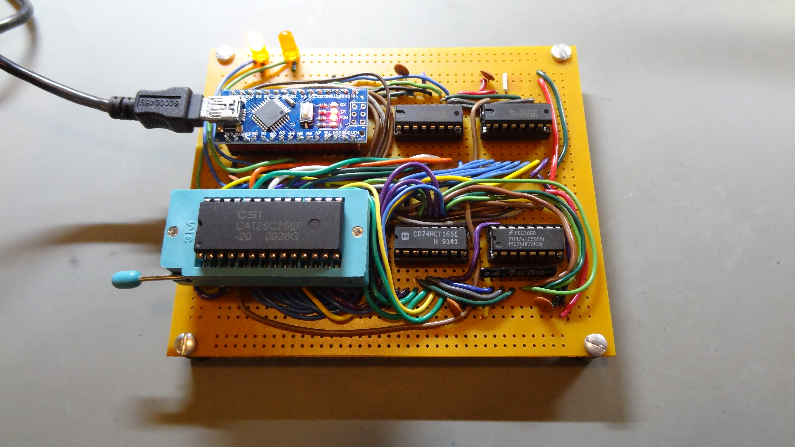

# 28C64/28C256 EEPROM programmer

This is an attempt to make a programmer for 28C64 and 28C256 EEPROMs using an Arduino Nano and 74HC595/74HCT165 shift registers.

The hardware seems to work.  The (KiCad) schematic is in the [hw](hw) directory.  The circuit has been constructed on a protoboard:

> 

The firmware (in the [eeprog](eeprog) directory) *seems* to work correctly at this point.  It can:

* read data from the EEPROM
* write single bytes to the EEPROM
* write a page (up to 64 bytes) to the EEPROM
* disable write protection
* enable write protection
* perform a software chip erase

## Host software

The host software is in the [hostutil](hostutil) directory.  It seems to work, although more testing is needed.  Currently, it has only been tested on Linux, but might work on other Unix-like systems (such as MacOS and FreeBSD.)

To build the host software, run the command `make` in the `hostutil` directory.  Copy the resulting executable (`eeprog`) to a directory that is on your executable path.

The command `eeprog -h` will print the following usage information:

```
eeprog host program version 1.1 (https://github.com/daveho/eeprog)
Usage: eeprog <options>
Options are:
  -f <filename>     specify input filename
  -p <port>         specify comm port
  -o <filename>     specify output filename
  -r <num bytes>    specify number of bytes to read
  -N                enable write protection
  -D                disable write protection
  -v                verify data after writing
  -h                print this help text
```

Here are some basic usage examples.

Write a binary file called `blink.bin` to a 32K EEPROM, disabling write protection before writing (necessary if the device is currently write-protected), enabling write protection after writing, and then verifying that the data was written correctly:

```
eeprog -f blink.bin -p /dev/ttyUSB0 -D -v -N
```

This command should produce something like the following output:

```
eeprog host program version 1.1 (https://github.com/daveho/eeprog)
Detected firmware version 0.2
Disabling write protection...
Writing 32768 bytes................................done
Enabling write protection...
Reading 32768 bytes................................done
Successful verification!
Done!
```

Note that you should change `/dev/ttyUSB0` as appropriate depending on the serial port device assigned to the Arduino.

Reading 32K of data from an EEPROM and saving the data in the output file `data.bin`:

```
eeprog -r 32768 -p /dev/ttyUSB0 -o data.bin
```

This command should produce something like the following output:

```
eeprog host program version 1.1 (https://github.com/daveho/eeprog)
Detected firmware version 0.2
Reading 32768 bytes................................done
Writing read data to 'data.bin'
Done!
```

Again, change `/dev/ttyUSB0` as appropriate.

## Firmware protocol

The firmware listens for commands on the UART (57600 bps, 8N1).  You can interact with it using the Arduino serial monitor or a terminal program.

The firmware prints the prompt `> ` (greater than followed by space) when it is ready to receive a command.

The commands are as follows.  All data and numeric parameters are specified using hexadecimal.  *aaaa* is an address.  *cc* is a count.  *dd* is a data byte.  Each command must be terminated by a line ending (either CRLF or just LF).  If a command has output, it will be on a single line.  All commands output either an "OK" line or an "Error: ..." line depending on whether the command succeeded or failed.  The "OK" output is generated after the command's output (if any).

All read and write commands increment the current address by the number of bytes read or written.

Command | Meaning | Example | Output
------- | ------- | ------- | ------
?       | show version and current address | `?` | Firmware version and current address
A*aaaa* | set current address | `A1F00` | None
W*dd*   | write one byte at current address | `W3E` | None
R*cc*   | read *cc* bytes of data at current address | `R10` | Data values read
P*ccdddd...* | write *cc* bytes of data at current address | `P05163bde4951` | None
D | disable write protection | `D` | None
N | enable write protection | `N` | None
E | perform software chip erase | `E` | None

Note that the `P` command can write up to 64 bytes (one "page"), and the data written should not cross a page address boundary.  I.e., if writing 64 bytes, the current address should be a multiple of 64.

The software chip erase may not work on non-Atmel EEPROM chips.
